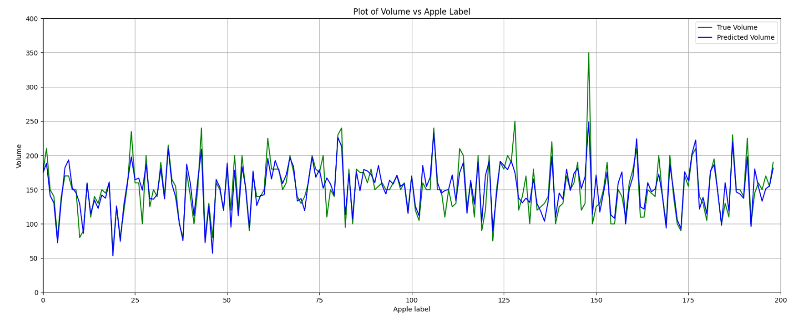

# Apple Volume Estimation Project

## Overview

This project focuses on estimating the volume of individual apples using a dataset that consists of 200 sampled apples. Each apple is individually considered, and 10 images are captured for each apple from 10 different orientations, all taken from a fixed height. In total, the dataset contains 200 * 10 images. The primary objective is to develop a system that accurately estimates the volume of each individual apple based on the provided images.

## Dataset

The dataset comprises 200 sampled apples, and for each apple, there are 10 images captured from different orientations, providing a total of 200 * 10 images for volume estimation. All photos are captured from a fixed height.

## Objective

The main goal of this project is to develop an estimation model capable of accurately determining the volume of each apple based on the provided images. This involves the use of image processing techniques, machine learning algorithms, or any other suitable methodologies.

## Approach

### Apporach 1

The chosen approach for apple volume estimation is inspired by the research paper titled ["Analytical Methods for Estimation of Volume of Axi-Symmetric Fruits Based on Single View Fruit Images"](https://ieeexplore.ieee.org/abstract/document/6108909). The paper describes analytical methods for volume estimation of axi-symmetric fruits, including apples, using single-view fruit images and shape-based analytical models.

The fruits are categorized into spherical, ellipsoid, and paraboloid shapes, and the methods extract eccentricity and shape-related parameters from the images. Appropriate analytical models are then applied for volume estimation. The proposed methods were tested in a laboratory setting and demonstrated reasonable accuracy.

#### Results 

- Mean Squared Error (MSE): 369.81
- Root Mean Squared Error (RMSE): 19.23
- Mean Percentage Error (MPE): 9.21%

#### Plots


 

### Apporach 2

The approach entails employing the support vector machine regression (SVMR) modeling technique to develop a model for estimating the volume of apple samples based on fitted ellipse parameters. It also involves exploring various kernels and analyzing their performance to compare their effectiveness.

Additionally, every possible combination of features is tested to determine the best features, dropping the results. The kernels used include linear, polynomial, rbf, maxtern, exponential, quadratic exponential, and rational quadratic.

#### Comparing SVMR Kernel Types

  

When employing the feature set including semi-major axis, semi-minor axis, perimeter, and eccentricity, the linear kernel achieves the most favorable outcomes. Subsequently, the following results are presented.

#### Results 

- Root Mean Squared Error (RMSE): 13.055
- Mean Squared Error (MSE): 170.438
- Mean Percentage Error (MPE): 6.721

#### Plots



 

## Usage

Follow these steps to utilize the project:

1. **Clone Repository:**
   ```bash
   https://github.com/Aditya-Y-29/Apple-Volume-Estimation
   cd apple-volume-estimation
